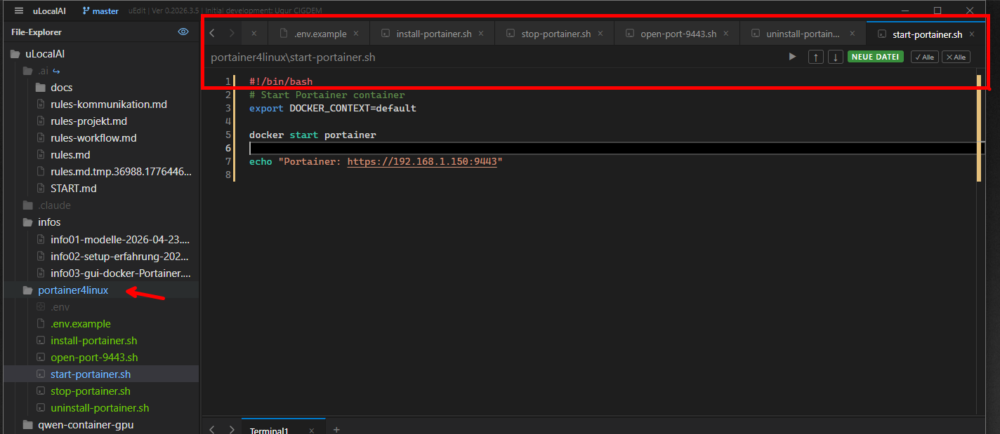
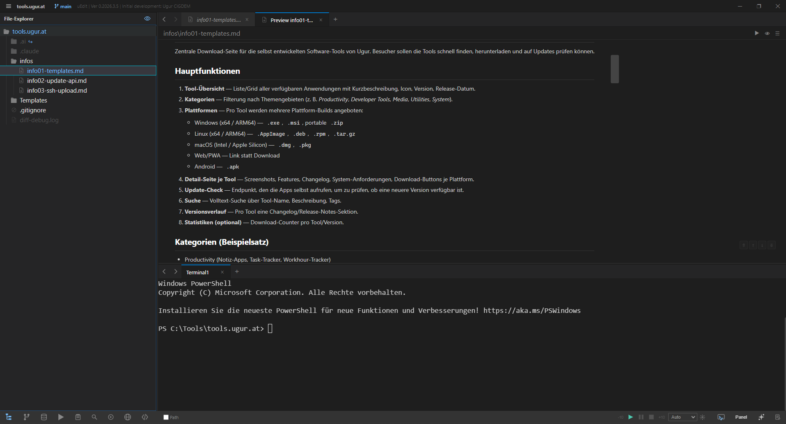
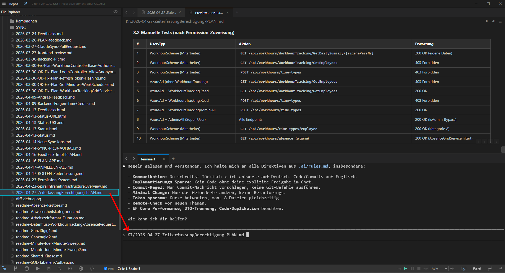
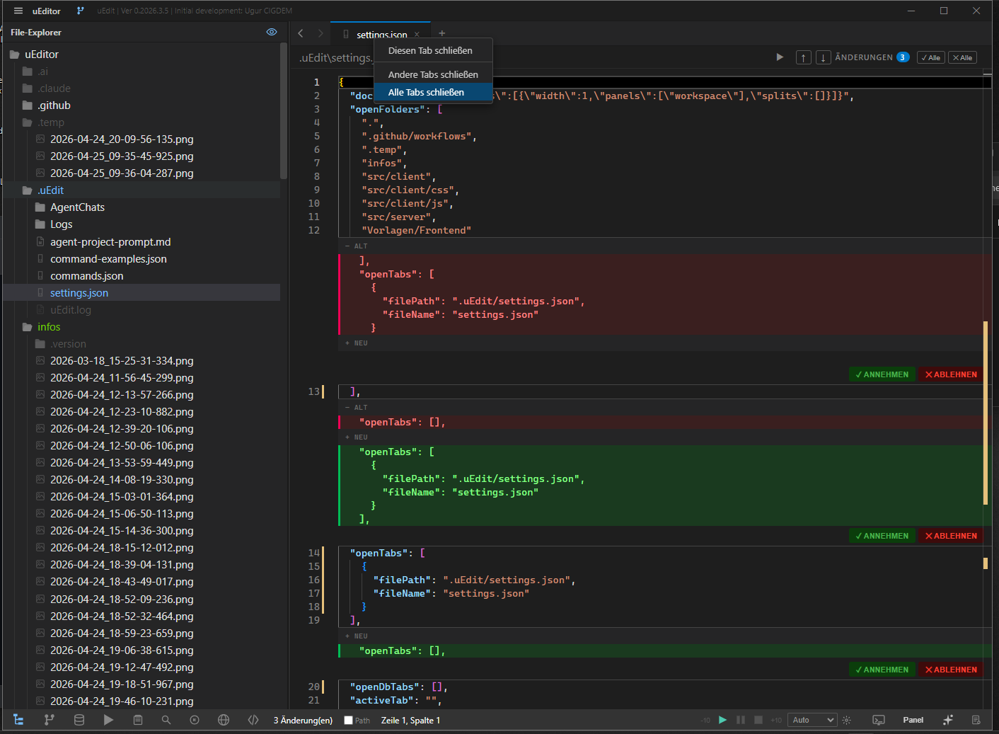

  

# uEdit

**Ein kostenloser, leichtgewichtiger Code-Editor — gebaut mit Electron und Monaco Editor.**
Keine Registrierung, keine Telemetrie, keine versteckten Kosten. Einfach öffnen und loslegen.

---

## Funktionen auf einen Blick

<table>
<tr>
<td width="80" align="center"><h1>⚡</h1></td>
<td><strong>Monaco Editor</strong> Dieselbe Editor-Engine wie VS Code — Syntax-Highlighting und IntelliSense für über 40 Sprachen.</td>
</tr>
<tr>
<td width="80" align="center"><h1>🖥️</h1></td>
<td><strong>Integriertes Terminal</strong> PowerShell, Bash oder CMD direkt im Editor. Mehrere Terminals gleichzeitig, ohne Fensterwechsel.</td>
</tr>
<tr>
<td width="80" align="center"><h1>🔀</h1></td>
<td><strong>Git-Integration</strong> Branch-Wechsel, Diff-Ansicht, Commit und Push — alles direkt im Editor, ohne Konsolen-Befehle.</td>
</tr>
<tr>
<td width="80" align="center"><h1>📝</h1></td>
<td><strong>Markdown-Vorschau</strong> Live-Vorschau neben dem Code, mit eingefärbten Code-Blöcken. Perfekt für README-Dateien und Notizen.</td>
</tr>
<tr>
<td width="80" align="center"><h1>🗄️</h1></td>
<td><strong>Datenbank-Verwaltung</strong> SQL Server direkt im Editor abfragen. Schema-Browser, Autovervollständigung und Ergebnis-Tabelle.</td>
</tr>
<tr>
<td width="80" align="center"><h1>🤖</h1></td>
<td><strong>KI-Agent</strong> Claude-Integration für Code-Analyse, Erklärungen und automatische Commit-Nachrichten — direkt im Terminal.</td>
</tr>
<tr>
<td width="80" align="center"><h1>🔊</h1></td>
<td><strong>Text-to-Speech</strong> Texte vorlesen lassen — Deutsch, Türkisch und Englisch mit neuronalen Stimmen.</td>
</tr>
<tr>
<td width="80" align="center"><h1>📂</h1></td>
<td><strong>Projekt-Verwaltung</strong> Schnell zwischen Projekten wechseln. Letzte Projekte, offene Tabs und Ordner-Verknüpfungen merken.</td>
</tr>
</table>

---

## Was macht uEdit besonders?

- 🤖 **KI-Agent direkt im Terminal** — Claude-Integration ohne Extensions, ohne Zusatzkosten, ohne Konfiguration
- 🗄️ **SQL-Browser eingebaut** — Datenbanken abfragen ohne externes Tool
- 🔊 **Vorlesen in drei Sprachen** — Deutsch, Türkisch, Englisch mit neuronalen Stimmen
- 🔒 **Null Telemetrie** — läuft komplett offline, keine Daten verlassen den Rechner
- ⚡ **Leicht und mächtig** — Monaco-Engine wie VS Code, ohne Extension-Last
- 📦 **Alles eingebaut** — Terminal, Git, Markdown-Vorschau, KI — kein Extension-Stöbern, keine Zusatz-Konfiguration

---

## Download & Installation

| Plattform | Download |
|---|---|
| Windows x64   | [Download](https://github.com/UgurCigdem/uEdit/releases/latest) |
| Windows ARM64 | [Download](https://github.com/UgurCigdem/uEdit/releases/latest) |
| Linux x64     | [Download](https://github.com/UgurCigdem/uEdit/releases/latest) |
| Linux ARM64   | [Download](https://github.com/UgurCigdem/uEdit/releases/latest) |

**Windows:** Setup-Datei herunterladen, starten, fertig. Keine zusätzliche Software nötig.
**Linux:** Archiv entpacken und `uEdit` ausführen.

---

## Funktionen im Detail

### Projekte verwalten

  

Ein Klick auf den Projektnamen oben links öffnet die **Liste der zuletzt geöffneten Projekte** (bis zu 15). Von dort:

- **Wechseln** — Klick auf einen Eintrag lädt das Projekt im aktuellen Fenster.
- **In neuem Fenster öffnen** — kleines ↗-Symbol beim Hover startet eine zweite Editor-Instanz.
- **Aus Liste entfernen** — ×-Symbol beim Hover entfernt den Eintrag (mit Rückfrage).

Unten im Picker gibt es zwei Aktionen:

**Neues Projekt öffnen…** — wählt einen Ordner über den Datei-Dialog und öffnet ihn in einem neuen Fenster.

**Clone Repository…** — klont ein Git-Repository direkt aus uEdit heraus:

1. Git-URL eingeben (HTTPS oder SSH — `https://github.com/user/repo.git` oder `git@github.com:user/repo.git`).
2. Zielordner über den Datei-Dialog auswählen.
3. uEdit klont das Repo im Hintergrund und öffnet es in einem neuen Fenster.

Nach dem Klonen scannt uEdit das Projekt nach bekannten Port-Konfigurationen und schlägt diese vor, falls vorhanden.

---

### File-Explorer

Der File-Explorer links im Editor zeigt die Datei-Struktur des Projekts. Drei Sichtbarkeits-Modi (Klick auf das 👁-Symbol oben — zyklischer Wechsel):

| Modus | Symbol | Anzeige |
|---|:---:|---|
| **Standard**  | 👁 ⚪ | Normale Dateien |
| **Versteckt** | 👁 🔵 | + Dot-Files (`.git`, `.env`, …) |
| **Alles**     | 👁 🟡 | + ignorierte Ordner wie `node_modules`, `dist`, … |

**Aktive Datei finden:** Wenn du eine Datei öffnest, wird der gesamte Pfad zum Tab im Tree blau hervorgehoben — keine Suche durch tiefe Ordner-Strukturen mehr.

**Dateien öffnen:**

- **Einfachklick** öffnet die Datei in einem temporären Vorschau-Tab. Klick auf eine andere Datei ersetzt diesen Tab — kein Tab-Stapel beim Durchblättern.
- **Doppelklick** öffnet die Datei als permanenten Tab.

**Mit der Tastatur:** Mehrfach-Auswahl per `Shift+Pfeil` oder `Ctrl+Klick`; `Strg+C/X/V` zum Kopieren, Ausschneiden und Einfügen; Drag & Drop zum Verschieben.

**Hover-Icons auf Ordnern:**

| Symbol | Funktion |
|:---:|---|
| 📄 | Neue Datei im Ordner anlegen |
| 📁 | Neuen Ordner anlegen |

**Rechtsklick-Menü** — kontextabhängig nach Datei oder Ordner:

- Neue Datei / Neuer Ordner
- Ordner verknüpfen… / Verknüpfung entfernen
- Einfügen (auf Ordnern)
- Relativen / Absoluten Pfad kopieren
- Anzeigen im Explorer (öffnet den Ordner im OS-Datei-Explorer)
- Terminal hier öffnen
- Extern starten (für Skripte `.bat`, `.cmd`, `.sh`, `.ps1`)
- Kopieren, Umbenennen, Löschen

**Ordner verknüpfen** — bindet einen externen Pfad als Verknüpfung in den aktuellen Workspace ein (praktisch für gemeinsame Notiz- oder Asset-Sammlungen über mehrere Projekte). Der Dialog merkt sich kürzlich verknüpfte Pfade; auf Wunsch wird der Link automatisch in die `.gitignore` aufgenommen.

---

### Suche im Projekt

Über das **Lupen-Symbol** in der Sidebar-Symbolleiste öffnet sich ein dedizierter Such-Bereich. Damit lassen sich Begriffe durch das gesamte Projekt suchen, ohne den Editor zu verlassen.

**Such-Optionen** im Suchfeld:

| Schalter | Bedeutung |
|:---:|---|
| **Aa** | Groß-/Kleinschreibung beachten |
| **WD** | Nur ganze Wörter |
| **🔄** | Regulärer Ausdruck (Regex) |

**Ergebnisse:**

- Gruppiert nach Datei — Datei-Name und Anzahl Treffer als Überschrift
- Pro Treffer: Zeilennummer und ein Code-Snippet mit hervorgehobenem Suchbegriff
- Klick auf einen Treffer öffnet die Datei und springt direkt zur Stelle
- Im Suchfeld zeigt `2/275` den aktuellen Treffer und die Gesamtzahl; `‹ ›` blättert durch die Ergebnisse

uEdit ignoriert automatisch typische Build- und Cache-Ordner (`node_modules`, `.git`, `bin`, `dist`, …) — keine Fundstellen aus generiertem Code, die die Liste zumüllen.

---

### Editor & Tabs

  

**Speichern mit Bestätigung:** `Strg+S` speichert die Datei. Die Statusleiste leuchtet zwei Sekunden grün auf — Du siehst sofort, dass die Speicherung tatsächlich erfolgt ist.

**Schutz vor Datenverlust:** Wird ein Tab mit ungespeicherten Änderungen geschlossen, fragt uEdit nach:

> **Nicht gespeicherte Änderungen** — Speichern, Verwerfen oder Abbrechen.

**Rechtsklick auf einen Tab** öffnet ein kompaktes Menü mit *Diesen Tab schließen*, *Andere Tabs schließen* und *Alle Tabs schließen*.

**Datei-Vorschauen** — uEdit rendert verschiedene Dateitypen direkt im Tab:

| Datei | Vorschau |
|---|---|
| Markdown (`.md`) | Live-Vorschau mit eingefärbten Code-Blöcken (über 180 Sprachen). Zusätzlich: Inhaltsverzeichnis, HTML-Quelltext-Ansicht, Sprachausgabe |
| HTML (`.html`) | Gerenderte HTML-Vorschau |
| PDF (`.pdf`) | PDF-Vorschau direkt im Editor |
| Word (`.docx`) | Word-Dokument gerendert (Dark-Mode-fähig) |
| CSV (`.csv`) | Tabellen-Ansicht |
| Outlook (`.msg`) | E-Mail-Vorschau |

Über die Symbolleiste rechts in der Breadcrumb-Leiste lassen sich Vorschau (👁), HTML-Quelltext (`</>`), Inhaltsverzeichnis (☰) und Sprachausgabe (▶) per Klick umschalten.

**Vorschau-Modus aktivieren:** Mit der gelben **Vorschau**-Checkbox in der Statusleiste öffnen sich Markdown- und HTML-Dateien direkt in der gerenderten Vorschau — ohne den Vorschau-Button extra zu klicken.

---

### Sprachausgabe (Text-to-Speech)

Klick auf das ▶-Symbol in der Markdown- oder HTML-Vorschau startet die Sprachausgabe. Eine eigene Player-Leiste am unteren Rand steuert die Wiedergabe:

`-10` zurück • `▶` Play • `⏸` Pause • `⏹` Stop • `+10` vor

**Sprachen:** Deutsch, Türkisch und Englisch — automatische Erkennung oder manuelle Wahl.

**Einstellungen** (Zahnrad-Button):

- **Stimme** wählen (z. B. „Hedda" für Deutsch)
- **Engine** umschalten zwischen Offline (lokal — Windows SAPI oder Piper auf Linux) und Cloud-API
- **Tempo** von 0.5× bis 3.0× regeln
- **Autoreader per Doppelklick** — startet TTS automatisch ab der angeklickten Stelle

**Mitlesen:** Während des Vorlesens wird das **aktuell gesprochene Wort** orange hervorgehoben — synchron in Code-Editor, Markdown-, HTML- und Word-Vorschau. So lässt sich dem Vorlesen visuell folgen.

---

### Terminal

uEdit integriert ein vollwertiges Terminal im unteren Panel — kein Wechsel zu einem externen Konsolen-Fenster nötig.

**Mehrere Terminals:** Über den `+`-Button öffnest du beliebig viele Terminals parallel. Tabs lassen sich mit `×` schließen und mit `‹ ›` durchblättern.

**Standard-Shells:** PowerShell oder CMD (Windows), Bash (Linux/macOS).

**Output kopieren:** Mit der Maus markieren und per Rechtsklick → **Kopieren** in die Zwischenablage übernehmen. Im selben Menü: *Einfügen* und *Alles auswählen*.

**Keys-Checkbox in der Statusleiste:** Schaltet das Verhalten von `Strg+C` / `Strg+V` im Terminal um:

| Keys | Strg + C | Strg + V |
|:---:|---|---|
| **aktiv** | Kopieren (Auswahl in die Zwischenablage) | Einfügen aus der Zwischenablage |
| **inaktiv** | Sendet `^C` an die Shell — bricht laufende Programme ab | Standard-Shell-Verhalten |

Schnell umschalten je nach Bedarf — abbrechen oder kopieren.

**Bild aus der Zwischenablage einfügen:** Liegt beim `Strg+V` ein Screenshot in der Zwischenablage (z. B. via `Win+Shift+S`), speichert uEdit das Bild automatisch als PNG in einem `.temp/`-Ordner und fügt den **vollständigen Dateipfad** ins Terminal ein. Praktisch für AI-CLIs: Screenshot machen → Strg+V → Pfad steht direkt im Prompt.

---

### AI-Integration & Live-Synchronisation

  

Wenn ein AI-CLI wie **Claude Code** im integrierten Terminal Dateien ändert, erkennt uEdit das automatisch und visualisiert die Änderungen direkt im Editor:

  

1. Die geänderte Datei öffnet sich automatisch in einem Tab.
2. Die geänderten Zeilen werden blau hervorgehoben (Pending Changes).
3. Du entscheidest pro Stelle oder für die ganze Datei: **Annehmen** oder **Verwerfen**.

Wird der Tab geschlossen, ohne dass etwas verworfen wurde, gelten die Änderungen automatisch als akzeptiert. Das funktioniert auch ohne Git — uEdit überwacht die Dateien direkt im Dateisystem.

**Burst-Schutz:** Tauchen plötzlich viele Dateien gleichzeitig auf (z. B. nach `npm install`), fragt uEdit, ob der betroffene Ordner zur `.watchignore` hinzugefügt werden soll — keine Tab-Flut.

**Überwachen-Checkbox in der Statusleiste:** Schaltet die Live-Synchronisation komplett aus, falls gewünscht. Bei deaktivierter Überwachung werden nur bereits offene, ungeänderte Tabs still aktualisiert; alles andere wird ignoriert.

---

### Datenbank-Browser

uEdit bringt einen vollständigen **SQL-Server-Browser** mit — Schemen sehen, Daten abfragen, Tabellen entwerfen. Kein externes Tool wie SSMS oder Azure Data Studio nötig.

**Verbindung herstellen:**

Im Verbindungs-Dialog gibst du Server-Adresse, Benutzername und Passwort ein. Server-Profile lassen sich speichern und über ein Dropdown wieder laden. Vor dem eigentlichen Verbinden kannst du mit **Verbindung testen** prüfen, ob die Zugangsdaten korrekt sind. Unterstützt werden SQL-Server- und Windows-Authentifizierung sowie verschlüsselte Verbindungen.

**Objekt-Explorer:**

In der linken Sidebar zeigt der Objekt-Explorer den gesamten Server-Baum:

- **Datenbanken** des Servers
- Pro Datenbank: **Tabellen**, **Ansichten**, **Prozeduren** und **Funktionen**
- Pro Tabelle: alle **Spalten** mit Datentyp und NULL-Kennzeichnung sowie **Trigger**

**Daten anschauen — Doppelklick:**

Doppelklick auf eine Tabelle öffnet einen Query-Tab mit einer fertigen `SELECT`-Abfrage. Die Daten werden **seitenweise** geladen — Default 100 Zeilen pro Seite, mit Vor/Zurück-Navigation und einstellbarer Seitengröße. Praktisch für große Tabellen, die du nicht komplett laden willst.

**Rechtsklick-Menü** auf einer Tabelle:

| Eintrag | Wirkung |
|---|---|
| **Entwerfen** | Öffnet den Tabellen-Designer — Spalten, Datentypen und NULL-Werte bearbeiten. Änderungen werden als SQL-Skript angezeigt, bevor sie ausgeführt werden. |
| **Erste 1000 Zeilen auswählen** | Schneller Daten-Blick ohne Pagination |
| **Umbenennen** | Tabellen-Name ändern |
| **Löschen** | Tabelle entfernen (mit Bestätigung) |
| **Aktualisieren** | Tree-Knoten neu einlesen |

---

### Git-Integration

uEdit bringt eine umfangreiche Git-Integration mit — Branch-Wechsel, Commit, Push, alles ohne Konsolen-Befehle.

**Branches verwalten:** Klick auf den Branch-Namen oben in der Titelleiste öffnet ein Dropdown mit allen lokalen und Remote-Branches, sortiert nach letzter Aktivität.

- **Wechseln:** Klick auf einen Branch
- **Neu anlegen:** Namen ins Suchfeld tippen und Enter — neuer Branch wird angelegt und direkt aktiv
- **Löschen:** Hover auf einen Branch → ❌-Symbol → Bestätigung. Der aktive Branch ist geschützt; bei nicht gemergten Branches fragt uEdit erneut nach.

**Status-Diagnose:** Eine eigene Ansicht zeigt auf einen Blick den Gesundheitszustand des Repos:

- Wie viele Dateien sind geändert, gestaged oder ungetrackt?
- Ist die Remote-URL korrekt? Welcher GitHub-Benutzer ist eingebettet?
- Ist der Remote-Server erreichbar?
- Ist der lokale Branch synchron, ahead, behind oder diverged?
- Gibt es offene Pull Requests?

**Änderungen committen:** Die *Changes*-Ansicht listet alle modifizierten Dateien mit Diff-Statistik (`+39 -0`). Auswahl pro Datei per Checkbox oder **Stage All**, dann Commit-Nachricht eingeben und **Commit Tracked** klicken. Der letzte Commit lässt sich mit einem Klick rückgängig machen (Änderungen bleiben erhalten).

**✏️ AI Commit Message:** Klick auf das Stift-Symbol generiert eine Commit-Nachricht automatisch aus dem aktuellen Diff — im Conventional-Commits-Format (z. B. `feat: add SSH key manager`). Die Nachricht erscheint im Eingabefeld und kann vor dem Commit beliebig angepasst werden. Voraussetzung: `npm install -g @anthropic-ai/claude-code`.

**Fetch, Pull, Rebase** — der Fetch-Button hat ein Dropdown mit drei Aktionen:

- **Fetch** — holt nur Refs vom Remote (kein Merge)
- **Pull** — Fetch + Merge
- **Pull (Rebase)** — Fetch + Rebase für lineare Historie

**Auto-Check beim Start:** Bei jedem Start und Projektwechsel prüft uEdit im Hintergrund, ob neue Commits am Remote liegen. Falls ja, erscheint ein blauer Hinweis-Toast mit *„Jetzt herunterladen?"* — ein Klick und der Pull läuft.

**SSH-Schlüssel verwalten:** Über den **SSH**-Button im Git-Panel öffnet sich ein Dialog zur Verwaltung der Schlüssel in `~/.ssh`:

- Alle Public-Keys mit Algorithmus und Fingerprint auflisten
- Schlüssel kopieren, mit `ssh -T git@github.com` testen oder direkt zu `github.com/settings/keys` springen
- Neuen Schlüssel per `ssh-keygen` erzeugen (ed25519 oder RSA-4096)
- `~/.ssh/config` direkt im Dialog bearbeiten — praktisch für mehrere GitHub-Konten über Host-Aliase
- Datei-Berechtigungen mit einem Klick reparieren (Windows und Linux/macOS)

---

### Schriftgröße anpassen

Mit **Strg + Mausrad** lässt sich die Schriftgröße in praktisch **jedem Bereich** der App anpassen — File-Explorer, Editor, Terminal, Markdown-Vorschau, Git-Panel, Datenbank-Browser, Suche und KI-Agent. Jeder Bereich speichert seinen eigenen Zoom-Level — der File-Tree kann z. B. klein bleiben, während der Editor auf großer Schrift läuft.

---

## Technologien

- **Electron** — Desktop-App für Windows und Linux
- **Monaco Editor** — Code-Editor-Engine von VS Code
- **Express.js** — Lokaler Backend-Server
- **node-pty** — Terminal-Emulation
- **Chokidar** — Dateiüberwachung in Echtzeit
- **WebSocket** — Live-Kommunikation zwischen Frontend und Backend

---

## Lizenz

Copyright © 2026 Ugur Cigdem. Alle Rechte vorbehalten.

uEdit ist **proprietäre Freeware**: kostenlos herunterladbar und nutzbar,
darf aber nicht verändert oder weiterverteilt werden. Siehe [`LICENSE`](LICENSE)
für die vollständigen Bedingungen.

---

  <em>Entwickelt von Ugur CIGDEM</em>

